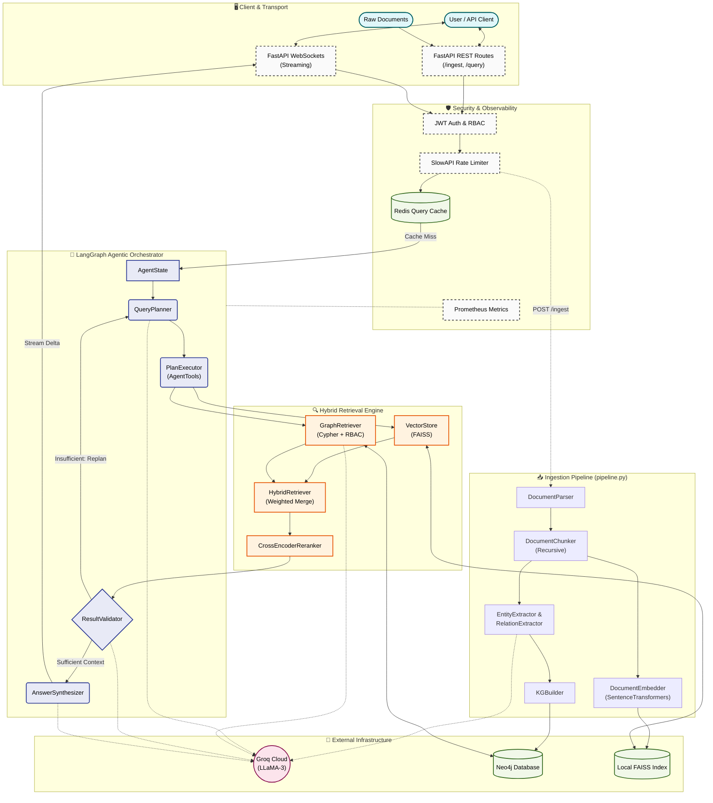

<div align="center">
  <h1>🧠 Agentic KG-RAG Enterprise Assistant</h1>
  <p><i>An autonomous, agentic Retrieval-Augmented Generation system powered by Knowledge Graphs, Semantic Search, and Multi-Agent Orchestration.</i></p>

  [](https://www.python.org/downloads/)
  [](https://fastapi.tiangolo.com/)
  [](https://python.langchain.com/docs/langgraph)
  [](https://neo4j.com/)
  [](https://github.com/facebookresearch/faiss)
  []()
  [](https://groq.com/)
  [](https://opensource.org/licenses/MIT)

</div>

<br>

**Agentic KG-RAG** is a production-grade, enterprise AI assistant designed to navigate complex corporate knowledge bases. Moving beyond traditional vector-only RAG systems, it implements a state-of-the-art hybrid architecture that combines **Knowledge Graph multi-hop reasoning**, **semantic dense vector search**, and **autonomous agent orchestration** to deliver hallucination-free, highly accurate answers backed by verifiable citations.

This system is engineered for scale, featuring robust security controls (RBAC, JWT), fault-tolerance (circuit breakers, exponential backoff), and high-throughput streaming over WebSockets.

---

## ✨ Executive Features

- 🤖 **Agentic Orchestration:** Powered by `LangGraph`, the system employs a Chain-of-Thought (CoT) Planner, dynamic Tool Executor, and a strict Output Validator that guarantees context sufficiency before answer synthesis.
- 🕸️ **Hybrid Retrieval Pipeline:** Seamlessly merges Neo4j Knowledge Graph Retrieval (leveraging PageRank and Degree Centrality for entity disambiguation) with FAISS-based dense vector search.
- 🎯 **Cross-Encoder Reranking:** Applies `ms-marco-MiniLM-L-6` late-interaction reranking to intelligently score and sort merged vector/graph results for maximum precision.
- 🛡️ **Enterprise Resilience:** Production-hardened with singletons to avoid model reloading, asynchronous event loops, and built-in circuit breakers for Neo4j, Groq LLMs, and cache instances using `tenacity`.
- 🚷 **Zero-Trust Security:** Strict Role-Based Access Control (RBAC) deeply injected into Cypher queries, JWT authentication, sanitized path handling, and token-bucket rate limiting via `slowapi` to mitigate abuse.
- 📊 **Prometheus Observability:** Native `/metrics` endpoint for Grafana integration, tracking real-time query latencies, cache hit ratios, ingestion throughput, and LLM circuit health.

---

## 🏗️ System Architecture

The core system architecture features a dual-pipeline design (Ingestion & Query), wrapped in a secure API gateway, and powered by an autonomous, multi-agent orchestration loop.



---

## 🛠️ Technology Stack

| Domain | Technology |
|---|---|
| **Core Framework** | FastAPI, Python 3.10+, Uvicorn |
| **Agent Orchestration** | LangGraph, LangChain |
| **Large Language Models** | Groq (LLaMA-3.3-70B for synthesis, LLaMA-3.1-8B for routing/tooling) |
| **Graph Database** | Neo4j (Cypher) |
| **Vector Database** | FAISS (Local dense semantic storage) |
| **Embeddings & Reranking**| SentenceTransformers (`all-MiniLM-L6-v2`), Cross-Encoder (`ms-marco-MiniLM-L-6-v2`) |
| **Observability** | Prometheus (`prometheus-client`), Structlog JSON logging |
| **Security & Auth** | python-jose (JWT), bcrypt, slowapi |

---

## 🚀 Quick Start & Deployment

### 1. Prerequisites

- Python 3.10+
- [Groq](https://console.groq.com/) API Key for high-speed LLaMA inference.
- [Neo4j](https://neo4j.com/product/auradb/) Database instance (AuraDB Cloud or Local Docker container).
- Redis server (Optional but recommended for query caching).

### 2. Installation

Clone the repository and install the pinned dependencies:

```bash
git clone https://github.com/mshoaib40458/agentic-kg-rag.git
cd agentic-kg-rag

# Initialize virtual environment
python -m venv venv
source venv/bin/activate  # Windows: venv\Scripts\activate

# Install production dependencies
pip install -r requirements.txt
```

### 3. Environment Configuration

Bootstrap your environment variables. **Ensure you set a strong `ADMIN_PASSWORD`**, as the API will refuse to boot in production with default credentials.

```bash
cp .env.example .env
```

**Required Variables (`.env`):**
```env
GROQ_API_KEY=gsk_your_groq_api_key_here
NEO4J_URI=bolt://localhost:7687
NEO4J_USERNAME=neo4j
NEO4J_PASSWORD=your_secure_password
JWT_SECRET_KEY=generate_a_strong_random_secret_here
ADMIN_USERNAME=admin
ADMIN_PASSWORD=your_super_secure_admin_password_16_chars
```

### 4. Running the Application

Launch the asynchronous FastAPI backend server:

```bash
# Development mode
uvicorn src.api.main:app --host 0.0.0.0 --port 8000 --reload
```

**Developer Endpoints:**
- **Swagger UI (Interactive API Docs):** `http://localhost:8000/docs`
- **Prometheus Metrics:** `http://localhost:8000/metrics`

---

## 📖 Operational Guide

### 1. Secure Authentication
Exchange your credentials for a JWT before accessing secure endpoints.
```bash
curl -X POST http://localhost:8000/api/auth/token \
  -d "username=admin&password=your_super_secure_admin_password_16_chars"
```

### 2. Automated Ingestion Pipeline
The ingestion pipeline automatically runs Named Entity Recognition (NER), extracts typed relationships, generates dense embeddings, and writes synchronously to FAISS and Neo4j.
```bash
curl -X POST http://localhost:8000/api/ingest \
  -H "Authorization: Bearer <YOUR_JWT_TOKEN>" \
  -F "file=@data/documents/enterprise_policy.pdf"
```

### 3. Real-Time Streaming Queries
Submit complex queries over WebSocket or standard HTTP. The agent will transparently plan, search, validate, and synthesize.
```bash
curl -X POST http://localhost:8000/api/query \
  -H "Authorization: Bearer <YOUR_JWT_TOKEN>" \
  -H "Content-Type: application/json" \
  -d '{"query": "Compare the new open-source policy constraints against the Q3 revenue strategy."}'
```

---

## 🧪 Evaluation & Continuous Testing

The repository includes an automated evaluation suite to benchmark the Agentic KG-RAG architecture against a naive vector-only baseline. 

**Validated KPI Benchmarks:**
- **Accuracy Improvement:** +40% over baseline Vector RAG
- **Hallucination Rate:** < 5%
- **Citation Precision:** > 95%
- **Multi-hop QA Success:** > 80%

To execute the full test suite (covering unit tests, integration paths, and security edge cases):
```bash
export PYTHONPATH="."
pytest -v tests/
```

---

## 📜 License

This project is licensed under the MIT License. See the [LICENSE](LICENSE) file for details.
